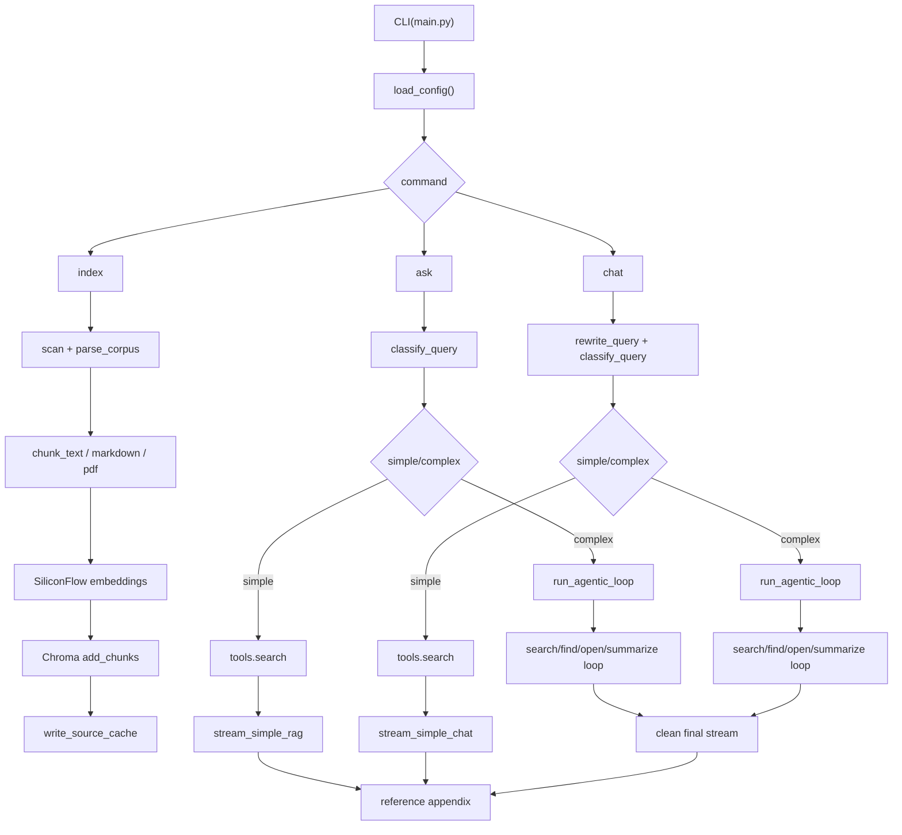

# AgenticRAG 技术架构与实现详解

## 1. 文档目的

本文档用于完整说明当前 `AgenticRAG` 项目的技术架构、代码模块划分、运行流程、状态管理、流式输出机制、引用体系、测试策略和已知边界。本文档以当前仓库实现为准，覆盖如下范围：

- CLI 入口与运行模式
- 文档索引构建与缓存
- 向量化与 Chroma 检索层
- Query Switcher 路由判定
- Prompt 体系与约束策略
- Retrieval Tool 的 schema 与执行细节
- Agentic Loop 的控制逻辑
- `ask` 单轮问答流程
- `chat` 多轮问答流程
- 会话状态、Reference ID、引用附录
- Token 预警与 summarize 压缩
- 流式输出与多工具链路收口
- 异常处理、回滚和测试覆盖

本文档对应的主要实现文件包括：

- [main.py](/D:/project/Paper复现/AgenticRAG/main.py)
- [agenticrag/config.py](/D:/project/Paper复现/AgenticRAG/agenticrag/config.py)
- [agenticrag/ingest.py](/D:/project/Paper复现/AgenticRAG/agenticrag/ingest.py)
- [agenticrag/embeddings.py](/D:/project/Paper复现/AgenticRAG/agenticrag/embeddings.py)
- [agenticrag/retriever.py](/D:/project/Paper复现/AgenticRAG/agenticrag/retriever.py)
- [agenticrag/state.py](/D:/project/Paper复现/AgenticRAG/agenticrag/state.py)
- [agenticrag/prompts.py](/D:/project/Paper复现/AgenticRAG/agenticrag/prompts.py)
- [agenticrag/switcher.py](/D:/project/Paper复现/AgenticRAG/agenticrag/switcher.py)
- [agenticrag/tools/schemas.py](/D:/project/Paper复现/AgenticRAG/agenticrag/tools/schemas.py)
- [agenticrag/tools/retrieval.py](/D:/project/Paper复现/AgenticRAG/agenticrag/tools/retrieval.py)
- [agenticrag/loop.py](/D:/project/Paper复现/AgenticRAG/agenticrag/loop.py)
- [agenticrag/chat.py](/D:/project/Paper复现/AgenticRAG/agenticrag/chat.py)

---

## 2. 项目定位与总体架构

### 2.1 项目定位

本项目是一个面向本地文档集的 Agentic RAG 原型系统。它不是单纯的“向量召回 + LLM 总结”，而是把检索过程拆成显式工具链，让大模型在复杂问题上通过 `search / find / open / summarize` 进行多步推理式检索。

系统目标分为两类：

1. `ask`：单轮查询，支持简单直接回答，也支持复杂问题下的工具循环。
2. `chat`：多轮对话，在延续会话状态的同时，支持问题改写、引用延续、复杂路径下的多工具检索与流式回答。

### 2.2 核心设计思想

项目的核心不是“让模型自由发挥”，而是通过以下机制给模型套上明确的执行边界：

- 用 `switcher` 先判定 `simple` 或 `complex`
- 用工具 schema 限制工具调用参数格式
- 用 `ConversationState` 显式保存消息、工具结果、引用 ID 和 token 状态
- 用 `SYSTEM_PROMPT` 强制复杂问题必须进行当前轮检索
- 用 `Reference ID` 把检索证据与最终答案关联起来
- 用 streaming 收口逻辑过滤协议残片和重复附录

### 2.3 总体运行架构



---

## 3. 目录结构与模块职责

### 3.1 顶层目录

- `main.py`：CLI 入口
- `agenticrag/`：核心实现
- `tests/`：单元测试与流程测试
- `docs/`：项目说明、设计文档、补充材料
- `.env.example`：环境变量示例
- `requirements.txt`：Python 依赖列表

### 3.2 `agenticrag/` 模块划分

| 模块 | 职责 |
| --- | --- |
| `config.py` | 读取 `.env`，校验运行参数 |
| `models.py` | 数据结构定义 |
| `ingest.py` | 文档扫描、解析、切块、源码缓存写入 |
| `embeddings.py` | Embedding 抽象与 SiliconFlow 客户端 |
| `retriever.py` | Chroma 持久化与检索封装 |
| `state.py` | 会话状态、消息、引用 ID、token 统计 |
| `llm.py` | DeepSeek Chat/Tool/Stream 封装 |
| `prompts.py` | 所有 Prompt 模板 |
| `switcher.py` | Query Switcher 路由判断 |
| `tools/schemas.py` | Tool Calling JSON Schema |
| `tools/retrieval.py` | `search/find/open/summarize` 真实执行器 |
| `loop.py` | Agentic Loop 主控制逻辑 |
| `chat.py` | 多轮会话、问题改写、流式过滤与回滚 |

---

## 4. 依赖体系与运行环境

### 4.1 关键依赖

`requirements.txt` 中的核心依赖包括：

- `openai`：统一调用 DeepSeek 与 SiliconFlow 的 OpenAI 兼容 API
- `chromadb`：向量数据库与持久化检索
- `pdfplumber`：PDF 文本提取
- `python-dotenv`：加载 `.env`
- `tiktoken`：近似统计 token
- `pytest`：测试框架

### 4.2 环境变量

由 [agenticrag/config.py](/D:/project/Paper复现/AgenticRAG/agenticrag/config.py) 负责读取和校验。

#### 必填项

- `DEEPSEEK_API_KEY`
- `SILICONFLOW_API_KEY`

#### 可选项及默认值

| 变量 | 默认值 | 用途 |
| --- | --- | --- |
| `DEEPSEEK_BASE_URL` | `https://api.deepseek.com` | DeepSeek 接口地址 |
| `DEEPSEEK_MODEL` | `deepseek-chat` | 生成模型 |
| `SILICONFLOW_BASE_URL` | `https://api.siliconflow.cn/v1` | Embedding 接口地址 |
| `SILICONFLOW_EMBEDDING_MODEL` | `Qwen/Qwen3-Embedding-4B` | 向量模型 |
| `EMBEDDING_DIMS` | `1536` | 向量维度 |
| `DOCS_DIR` | `docs` | 默认索引目录 |
| `CHROMA_DIR` | `.chroma` | Chroma 持久化目录 |
| `SOURCE_CACHE_DIR` | `.agenticrag_cache` | 源文档缓存目录 |
| `MAX_CALLS` | `15` | 单轮最大工具调用控制 |
| `TOKEN_THRESHOLD` | `128000` | token 上限近似阈值 |
| `TOKEN_WARNING_RATIO` | `0.9` | token 预警比例 |

#### 校验规则

- `EMBEDDING_DIMS > 0`
- `MAX_CALLS > 0`
- `TOKEN_THRESHOLD > 0`
- `0 < TOKEN_WARNING_RATIO < 1`

如果校验失败，配置加载阶段直接报错，阻止进入运行期。

---

## 5. 数据模型设计

由 [agenticrag/models.py](/D:/project/Paper复现/AgenticRAG/agenticrag/models.py) 定义。

### 5.1 `DocumentChunk`

表示一个可检索的最小文档片段，字段包括：

- `doc_id`
- `path`
- `title`
- `filetype`
- `chunk_index`
- `line_start`
- `line_end`
- `content`

这是整个系统最核心的数据单元，索引、检索、引用、打开原文都围绕它展开。

### 5.2 `RetrievedChunk`

检索返回结构，包含：

- `chunk: DocumentChunk`
- `score: float`

并提供 `snippet` 便于在搜索结果中显示截断内容，默认取前 200 个字符。

### 5.3 `Reference`

将系统内部 `reference_id` 映射到实际 `DocumentChunk`。引用标识如：

- `turn0search0`
- `turn3search7`

### 5.4 `ToolResult`

记录一次工具执行的可见结果：

- `name`
- `content`
- `metadata`

`metadata` 常用于存放：

- `reference_ids`
- `unknown_reference_ids`
- provider 层的 `tool_call_id`

### 5.5 `ToolCall`

表示模型发起的一次工具调用，字段：

- `id`
- `name`
- `arguments`

其 `arguments` 被包成只读映射，避免运行期被误修改。

---

## 6. 索引构建与文档解析

核心实现位于 [agenticrag/ingest.py](/D:/project/Paper复现/AgenticRAG/agenticrag/ingest.py)。

### 6.1 支持的文档类型

当前仅支持：

- `.md`
- `.pdf`

`scan_documents()` 使用 `Path.rglob("*")` 递归扫描 `docs` 目录，并按路径排序，保证构建结果稳定。

### 6.2 文档 ID 生成

`make_doc_id()` 采用：

```text
sha1(path.as_posix())[:16]
```

特点：

- 同一路径稳定复现同一 `doc_id`
- 不依赖内容哈希，便于源缓存与引用映射
- 长度固定，便于在缓存文件和 metadata 中使用

### 6.3 文本标准化

系统将文本统一为 LF 换行，减少：

- Windows CRLF/Unix LF 混用
- 行号偏移
- chunk 定位不一致

### 6.4 Markdown 标题提取

Markdown 文档标题优先取首个一级标题：

- 匹配第一个 `# `
- 若不存在，则退化为文件名 stem

### 6.5 Chunk 切分算法

`chunk_text()` 的默认参数：

- `max_chunk_size = 1000`
- `overlap = 100`
- `min_chunk_size = 50`

核心策略：

1. 先按中英文句号、问号、感叹号等标点切分
2. 尽量在句边界内拼接到 `max_chunk_size`
3. 若单段过长，则按宽度硬切
4. 末尾过小 chunk 尝试向前合并
5. 相邻 chunk 保持 `overlap`

这样做的目的，是兼顾：

- 语义完整性
- embedding 粒度
- 检索命中率
- 引用时的上下文可读性

### 6.6 Markdown 结构切分

Markdown 会先用 `_split_markdown_sections()` 按 `## ` 二级标题切分章节，再对章节内容执行 `chunk_text()`。

额外处理包括：

- `_line_span_for_text()`：定位 chunk 对应原文行范围
- `_advance_search_start()`：避免重复从文首搜索，提升定位稳定性

因此 Markdown chunk 不只是“内容切块”，还保留了可靠的原文行号映射。

### 6.7 PDF 解析

PDF 使用 `pdfplumber` 逐页提取文本：

- 空白页和纯空白文本页会被忽略
- 每页前加前缀 `[page N]`
- 再将整份拼接文本送入统一 chunk 流程

优点：

- 保留页码语义，便于回答时说明来源
- 避免把 PDF 和 Markdown 走两套完全不同的索引体系

### 6.8 解析容错

`parse_corpus()` 在单文件解析失败时：

- 向 `stderr` 输出 warning
- 跳过该文件
- 不阻断整个 corpus 的构建

这让索引过程具备较好的批量容错性。

### 6.9 源文档缓存

索引完成后调用 `write_source_cache()`，在 `.agenticrag_cache` 下按 `doc_id` 写 JSON 缓存，内容包括：

- `doc_id`
- `path`
- `title`
- `filetype`
- `lines`

其中 `lines` 是按 UTF-8 `errors="ignore"` 读取的原始文本行列表。这个缓存直接服务于：

- `find`
- `open`
- 引用定位

也就是说，向量库只负责召回，源码缓存负责二次精确定位。

---

## 7. Embedding 层设计

实现位于 [agenticrag/embeddings.py](/D:/project/Paper复现/AgenticRAG/agenticrag/embeddings.py)。

### 7.1 抽象接口

项目定义了 `EmbeddingClient` 协议，抽象出：

- 输入：`list[str]`
- 输出：`list[list[float]]`

这样上层索引与检索逻辑不依赖某个具体提供商。

### 7.2 `SiliconFlowEmbeddingClient`

当前生产实现使用 SiliconFlow 的 OpenAI 兼容 embeddings API：

- 通过 `OpenAI(api_key=..., base_url=...)`
- 指定 `SILICONFLOW_EMBEDDING_MODEL`
- 批量生成向量

实现细节：

- 若响应含 `index` 字段，会先按 `index` 排序
- 严格校验返回向量数量是否与输入文本数量一致

这一步很关键，因为返回顺序错误会直接污染 Chroma 索引。

### 7.3 `FakeEmbeddingClient`

测试环境使用伪 embedding：

- 对文本做 `sha1`
- 用稳定随机种子生成固定维度向量

这样可以：

- 不依赖外部 API
- 让测试结果可重复
- 保持检索逻辑接口不变

---

## 8. 检索与向量存储层

实现位于 [agenticrag/retriever.py](/D:/project/Paper复现/AgenticRAG/agenticrag/retriever.py)。

### 8.1 Chroma 持久化客户端

`ChromaRetriever` 基于：

- `chromadb.PersistentClient`

默认 collection 名为：

- `agenticrag`

向量数据会持久化在 `CHROMA_DIR` 对应目录。

### 8.2 索引写入

`add_chunks()` 会将每个 chunk 写入 Chroma，字段包括：

- `ids`：`<doc_id>:<chunk_index>`
- `documents`：chunk 文本
- `embeddings`：由 embedding client 生成
- `metadatas`：`DocumentChunk.to_metadata()`

其中 metadata 需要足够完整，后续 query 时才可重建 `DocumentChunk`。

### 8.3 清空重建

`reset()` 会删除旧 collection 后重新创建，若 collection 不存在，仅忽略 `NotFoundError`。

这意味着当前 `index` 命令采用“全量重建索引”的策略，而不是增量更新。

### 8.4 Query 流程

`query()` 的步骤如下：

1. 为查询文本生成单条 embedding
2. 调用 Chroma `query()`
3. 请求返回：
   - `documents`
   - `metadatas`
   - `distances`
4. 使用 `_extract_query_field()` 严格校验每个字段结构
5. 从 metadata 重建 `DocumentChunk`
6. 封装为 `RetrievedChunk`

严格校验是为了避免把 Chroma 异常响应默默吞掉，导致后续引用或 `open` 定位错乱。

---

## 9. CLI 入口与运行模式

入口位于 [main.py](/D:/project/Paper复现/AgenticRAG/main.py)。

### 9.1 编码处理

`configure_stdio()` 会把：

- `stdin`
- `stdout`
- `stderr`

重新配置为 UTF-8，并设置 `errors="replace"`。

这么做主要为了解决 Windows 控制台常见的中文输出乱码问题，尤其是：

- 中文问答
- Markdown 标题
- PDF 内容
- 引用附录

### 9.2 支持的命令

CLI 共有三种入口：

1. `python main.py index`
2. `python main.py ask "你的问题"`
3. `python main.py chat`

### 9.3 `index` 模式

执行顺序：

1. `load_config()`
2. `has_supported_documents()`
3. `parse_corpus()`
4. 若没有 chunk：
   - 若目录内有支持文件但均解析失败，提示“未生成 chunk”
   - 若目录下根本没有支持文件，提示“未找到支持文档”
5. 构造 `SiliconFlowEmbeddingClient`
6. 构造 `ChromaRetriever`
7. `retriever.reset()`
8. `retriever.add_chunks(chunks)`
9. `write_source_cache()`

### 9.4 `ask` 模式

调用 [agenticrag/loop.py](/D:/project/Paper复现/AgenticRAG/agenticrag/loop.py) 中的 `run_ask()`。

### 9.5 `chat` 模式

调用 [agenticrag/chat.py](/D:/project/Paper复现/AgenticRAG/agenticrag/chat.py) 中的 `run_chat()`，支持：

- `/help`
- `/reset`
- `/exit`
- `/quit`

---

## 10. Prompt 体系设计

所有 Prompt 位于 [agenticrag/prompts.py](/D:/project/Paper复现/AgenticRAG/agenticrag/prompts.py)。

### 10.1 `SWITCHER_PROMPT`

作用：让模型只输出 JSON，判定当前问题走：

- `simple`
- `complex`

这是系统的第一层策略分流。

### 10.2 `QUERY_REWRITE_PROMPT`

用于 `chat` 模式下的问题改写，目标是：

- 解决代词、省略、追问
- 把当前问题改写成自包含问题
- 如果当前问题本身已经独立，保持原意不改写

这个 Prompt 明确要求：

- 仅在确有上下文依赖时改写
- 不得把话题错误迁移到旧问题
- 只能返回严格 JSON

### 10.3 `SYSTEM_PROMPT`

这是复杂路径下最重要的行为约束。其核心要求包括：

- 不确定时先检索再回答
- 优先 `search`，必要时再 `find`、`open`
- 每个复杂问题的新一轮都必须有当前轮检索
- 对比类问题即使历史中已有引用，也要在当前轮重新检索验证
- 只要使用了工具证据，就必须在最终回答中体现引用
- 默认使用中文回答

### 10.4 `SIMPLE_RAG_PROMPT`

用于 `ask` 模式下简单路径：在单次搜索结果基础上直接流式回答。

### 10.5 `CHAT_SIMPLE_RAG_PROMPT`

用于 `chat` 模式下简单路径，额外包含：

- 原始用户问题
- 改写后的问题
- 搜索上下文

这样既能保留用户原始表达，也能让回答建立在“自包含查询”之上。

### 10.6 `FORCE_FINAL_ANSWER_PROMPT`

当工具调用达到上限时，系统通过该 Prompt 强制模型停止继续调工具，基于已有证据收口输出最终答案。

---

## 11. Query Switcher 路由机制

实现位于 [agenticrag/switcher.py](/D:/project/Paper复现/AgenticRAG/agenticrag/switcher.py)。

### 11.1 作用

`classify_query()` 负责把用户问题划分为：

- `simple`：单次搜索即可回答
- `complex`：需要工具循环和多步检索

### 11.2 实现方式

流程如下：

1. 组装 `SWITCHER_PROMPT + query`
2. 调用 `DeepSeekClient.complete()`
3. 从返回文本中提取第一个合法 JSON
4. 读取 `route`

### 11.3 容错策略

若出现以下情况：

- 无法解析 JSON
- `route` 缺失
- `route` 非 `simple/complex`

则默认走：

- `complex`

也就是说，系统在路由不确定时偏保守，宁可多做检索，也不轻易直接回答。

---

## 12. 会话状态与 Reference ID 体系

实现位于 [agenticrag/state.py](/D:/project/Paper复现/AgenticRAG/agenticrag/state.py)。

### 12.1 `ConversationState` 维护的内容

状态对象包含：

- `messages`
- `references`
- `tool_results`
- `turn_index`
- token 预警标记

### 12.2 初始消息策略

若构造状态时没有传初始消息，会自动加入初始 user message，避免后续流程面对空消息列表。

### 12.3 引用 ID 分配

`assign_search_results()` 会给当前轮搜索结果分配：

```text
turn{turn_index}search{index}
```

分配完成后自增 `turn_index`。

这意味着：

- 每轮 search 的 Reference ID 都是唯一的
- 可以区分不同轮次的相同文档片段
- 可显式判断“当前轮引用”和“历史轮引用”

### 12.4 工具结果入状态

`add_tool_result()` 会同时写入：

1. `tool_results`
2. `messages` 中的一条 `role=tool` 消息

因此系统既保留结构化工具结果，也保留供模型继续推理的消息历史。

### 12.5 Token 估算

`total_tokens()` 使用 `tiktoken` 的 `cl100k_base` 编码进行近似估算。它不是 provider 实际账单 token，但足够用于本地流程控制。

### 12.6 Token 预警

`maybe_add_token_warning()` 在总 token 超过：

```text
TOKEN_THRESHOLD * TOKEN_WARNING_RATIO
```

后，仅插入一次内部 warning system message。

这个 warning 的目的不是给用户看，而是提醒模型减少无效展开。

### 12.7 summarize 压缩

`summarize(candidate_reference_ids)` 会：

- 保留 candidate 中仍需保留的引用对应工具结果
- 将无关旧工具结果压缩为 `[compressed ...]`
- 同步重写对应 `tool` 消息

这样做是为了在长对话中：

- 控制 token 增长
- 保留关键引用
- 不破坏消息顺序

---

## 13. Retrieval Tool Schema 设计

定义位于 [agenticrag/tools/schemas.py](/D:/project/Paper复现/AgenticRAG/agenticrag/tools/schemas.py)。

### 13.1 `search`

参数：

- `queries: string[]`

限制：

- 最少 1 条
- 最多 5 条

### 13.2 `find`

参数：

- `reference_id: string`
- `patterns: string[]`

限制：

- `patterns` 最多 10 条

### 13.3 `open`

参数：

- `reference_id: string`
- `line_number: integer`

限制：

- `line_number >= 0`
- 默认值 `0`

### 13.4 `summarize`

参数：

- `candidate_reference_ids: string[]`

限制：

- 最多 20 个

这些 schema 既服务于模型 Tool Calling，也服务于运行期参数校验。

---

## 14. Retrieval Tool 实现细节

实现位于 [agenticrag/tools/retrieval.py](/D:/project/Paper复现/AgenticRAG/agenticrag/tools/retrieval.py)。

### 14.1 统一执行器

`RetrievalTools` 构造时注入：

- `retriever`
- `state`
- `source_cache_dir`

这意味着工具层同时依赖：

- 向量召回
- 会话状态
- 原文缓存

### 14.2 `search`

执行逻辑：

1. 规范化查询字符串
2. 去重
3. 最多保留 5 条 query
4. 每条 query 在 Chroma 取 `top_k=10`
5. 合并结果并去重
6. 最终最多保留 10 条结果
7. 调用 `assign_search_results()` 分配 Reference ID
8. 格式化成：
   - `[ref] title (path:start-end)`
   - 内容正文
9. 写入 `ToolResult.metadata["reference_ids"]`

去重键包含：

- `doc_id`
- `chunk_index`
- `line_start`
- `line_end`
- `content`

所以同一段内容不会因为多 query 命中而重复出现在同一轮搜索结果里。

### 14.3 `find`

`find(reference_id, patterns)` 的职责，是在指定引用所对应的源文档里做精确模式搜索。

实现细节：

- 先校验 `reference_id` 是否存在
- 通过源缓存加载 `lines`
- pattern 规范化、去重，最多 10 条
- 大小写不敏感子串匹配
- 每个 pattern 最多返回 2 处命中
- 每条命中前后各保留约 50 个字符上下文

如果引用无效或缓存损坏，会生成可见的：

```text
[tool error] ...
```

并将其也写入状态。

### 14.4 `open`

`open(reference_id, line_number=0)` 用于查看源文档片段。

规则如下：

- 若 `line_number <= 0`，默认以该引用 chunk 的 `line_start + 1` 为中心
- 打开窗口大约为中心前后各 20 行
- 返回头部信息：
  - 当前展示行号范围
  - 文档总行数

输出形态类似：

```text
Viewing lines [start-end] of total total_lines
```

它的目标不是全文输出，而是让模型在局部上下文里做二次确认。

### 14.5 `summarize`

执行逻辑：

1. 保留当前存在的 reference
2. 识别无效 `reference_id`
3. 调用 `state.summarize()`
4. 返回保留和忽略结果说明
5. 把 `reference_ids` 和 `unknown_reference_ids` 写入 metadata

### 14.6 工具错误的统一可见化

`_store_error()` 的设计很关键。它会把工具错误写成一个正常 `ToolResult`：

- 用户可见
- 模型后续也可见
- 状态机内部可追踪

这避免了“工具 silently fail，但模型继续编造”的情况。

---

## 15. DeepSeek LLM 封装

实现位于 [agenticrag/llm.py](/D:/project/Paper复现/AgenticRAG/agenticrag/llm.py)。

### 15.1 `complete(messages)`

用于：

- switcher 分类
- query rewrite
- 其他非流式 JSON 响应

调用方式：

- `chat.completions.create(stream=False)`

### 15.2 `stream(messages)`

用于最终用户回答流式输出：

- `chat.completions.create(stream=True)`
- `collect_stream_text()` 逐段提取 `delta.content`

### 15.3 `tool_call(messages, tools)`

用于复杂路径下的工具选择：

- 传入 OpenAI function-calling schema
- `stream=False`

也就是说，项目把“选工具”和“给用户流式出答案”分成了两个不同阶段。

---

## 16. Agentic Loop 控制逻辑

实现位于 [agenticrag/loop.py](/D:/project/Paper复现/AgenticRAG/agenticrag/loop.py)。

### 16.1 角色

`run_agentic_loop()` 是复杂问题的总控器，负责：

- 让模型决定是否调用工具
- 执行工具
- 把工具结果回灌到状态
- 控制最大调用次数
- 在适当时机切换到最终流式回答

### 16.2 主循环步骤

1. 确保 `SYSTEM_PROMPT` 只注入一次
2. 记录本轮开始时 `tool_results` 的起始下标
3. 检查 token，并在必要时触发 summarize
4. 调用 `tool_call()`
5. 若返回工具调用：
   - 记录 assistant tool-call message
   - 向终端输出 `[tool] name`
   - 执行对应 retrieval tool
   - 将结果写入状态
6. 若模型不再调工具而直接给内容：
   - 判断当前轮是否已经发生过检索
   - 判断是否为多步工具链
   - 决定是直接输出还是走 clean final streaming
7. 超过 `MAX_CALLS` 时，强制基于现有证据收口

### 16.3 当前轮必须检索的约束

复杂路径不是“只要历史里搜过就行”。系统显式要求：

- 每个复杂问题都必须有当前轮 retrieval

如果模型试图跳过这一点：

- 系统会自动触发 `_run_automatic_search()`，或
- 注入 `CURRENT_TURN_TOOL_REQUIRED_PROMPT` 再让模型继续

这样可以避免多轮会话里“拿旧上下文硬答新问题”。

### 16.4 自动搜索兜底

`_run_automatic_search()` 会：

- 输出 `[tool] search`
- 以最新自包含查询执行一次 search
- 把结果作为 system evidence 注入
- 移除刚加进去的 `tool` message，避免污染最终显示历史

这个分支用于处理模型“本该检索却想直接回答”的情况。

### 16.5 多步工具链后的最终回答

当当前轮存在 2 次及以上工具活动时，系统不会直接把模型原始最终文本吐给用户，而是调用 `_build_streaming_final_messages()` 重建一套“干净消息”再流式输出。

重建时会：

- 去掉旧 `system`
- 去掉 `tool` role 消息
- 去掉 assistant 的 `tool_calls`
- 增加一个只允许“面向用户最终回答”的 system 指令
- 将本轮工具证据整理成 system evidence 注入

这样能防止最终流里夹带：

- Tool Call 协议残片
- DSML/XML
- 中间推理格式
- 重复引用附录

### 16.6 超过最大工具次数时的强制收口

如果达到 `MAX_CALLS` 但当前轮已经做过必要检索，则：

1. 追加 `FORCE_FINAL_ANSWER_PROMPT`
2. 调用 `_build_streaming_final_messages(force_final=True)`
3. 增加“tool budget exhausted”约束
4. 基于现有证据直接回答

### 16.7 无证据时的最终兜底

如果模型既没给出可靠证据，也无法在预算内完成工具链，系统会输出一条中文的证据不足提示，拒绝编造答案。

---

## 17. `ask` 模式完整流程

`run_ask(query)` 位于 [agenticrag/loop.py](/D:/project/Paper复现/AgenticRAG/agenticrag/loop.py)。

### 17.1 启动流程

1. `load_config()`
2. 初始化 `DeepSeekClient`
3. 初始化 `SiliconFlowEmbeddingClient`
4. 初始化 `ChromaRetriever`
5. 创建 `ConversationState`
6. 创建 `RetrievalTools`
7. `classify_query()`

### 17.2 简单路径

若路由结果为 `simple`：

1. 执行 `tools.search([query])`
2. 调用 `stream_simple_rag()`
3. 边生成边输出最终答案
4. 基于答案正文 + 当前轮工具结果拼接 Reference ID 附录

特点：

- 单次检索
- 单次流式回答
- 最终统一追加引用附录

### 17.3 复杂路径

若路由结果为 `complex`：

1. 进入 `run_agentic_loop(... require_current_turn_retrieval=True)`
2. 模型可多轮调 `search/find/open/summarize`
3. 最后由 loop 决定如何流式输出最终答案
4. 再追加 Reference ID 附录

---

## 18. `chat` 模式完整流程

实现位于 [agenticrag/chat.py](/D:/project/Paper复现/AgenticRAG/agenticrag/chat.py)。

### 18.1 ChatSession 的职责

`ChatSession` 负责维护长生命周期会话，包括：

- 历史消息
- 历史引用
- 历史工具结果
- 多轮查询改写
- 本轮异常回滚
- 最终对用户可见的流式输出整形

### 18.2 问题改写消息构造

`build_rewrite_messages()` 会向 rewrite 模型提供：

- 最近 8 条非工具对话摘要
- “上下文只用于消解指代，不要篡改独立问题”的 guard
- 最近 12 个可用 Reference ID 概览
- 当前用户原始问题

这样设计的目标，是让 rewrite 只在必要时利用上下文，而不是把旧话题强行带入新问题。

### 18.3 `rewrite_query()`

行为：

- 优先尝试解析严格 JSON
- 若失败、异常或返回无效，退回原始用户输入

这是一个“保守重写器”：宁可不改，也不做错误改写。

### 18.4 Simple Chat 流程

若 rewrite 后问题被判定为 `simple`：

1. 输出 `[tool] search`
2. `tools.search([rewritten_query])`
3. 移除工具消息，避免污染可见历史
4. 调用 `stream_simple_chat()`
5. 使用 `_iter_answer_body()` 过滤流中的协议/附录污染
6. 生成并追加程序化引用附录
7. 仅将答案正文写入 assistant 历史，不保存附录

“只保存正文”这一点很重要，否则下一轮会把旧附录当自然语言上下文，导致重复引用和路由混乱。

### 18.5 Complex Chat 流程

若被判定为 `complex`：

1. 将最新 user message 改写成“原始问题 + 自包含问题”的组合内容
2. 移除残留工具消息
3. 保存当前可见消息快照
4. 调用 `run_agentic_loop(... require_current_turn_retrieval=True)`
5. 用 `_iter_answer_body()` 过滤输出
6. 回答结束后恢复可见消息历史
7. 追加程序化引用附录
8. 只将正文写入 assistant 历史

### 18.6 可见历史与内部历史分离

复杂路径里，系统会临时允许 loop 使用更丰富的内部状态，但最终对 chat 可见历史进行收口清理。这是为了同时满足：

- 模型需要工具消息继续推理
- 用户不应在下一轮上下文里看到工具协议垃圾

### 18.7 `/reset`

清空当前会话状态，让后续轮次重新开始。

---

## 19. 引用体系与 Reference ID 附录

引用生成相关逻辑主要在 [agenticrag/loop.py](/D:/project/Paper复现/AgenticRAG/agenticrag/loop.py)。

### 19.1 Reference ID 的来源

只有 `search` 结果会产生正式 `Reference ID`。`find` 和 `open` 是围绕已有引用做深化，不会新建搜索级引用。

### 19.2 引用附录生成

`build_reference_id_section()` 会在回答正文后生成：

```text
引用标识（Reference ID）：
- turnXsearchY: 标题 (路径:行号范围)
```

### 19.3 当前轮优先原则

附录优先使用当前轮工具结果里的引用，而不是无条件复用旧轮引用。这样做是为了保证：

- 本轮回答引用与本轮证据一致
- 避免 chat 多轮里把旧轮附录重复拼进去

### 19.4 回退逻辑

如果正文中没有显式引用，但当前轮工具确实用到了 `search/find/open`，系统会回退挑选最多 5 个相关引用加入附录。

### 19.5 为什么附录是程序化追加

项目没有完全信任模型自行输出引用附录，而是在流式正文结束后由程序拼接。这是为了避免：

- 模型漏引用
- 模型重复附录
- 模型输出伪造 reference id

---

## 20. 流式输出实现与收口机制

这是当前项目最关键、也最容易出问题的部分之一，主要位于 [agenticrag/chat.py](/D:/project/Paper复现/AgenticRAG/agenticrag/chat.py) 与 [agenticrag/loop.py](/D:/project/Paper复现/AgenticRAG/agenticrag/loop.py)。

### 20.1 简单路径的流式输出

`simple` 路径下：

- search 先同步执行
- 最终答案通过 `DeepSeekClient.stream()` 流式返回
- 引用附录在正文结束后再由程序一次性补上

### 20.2 多工具链路的问题来源

复杂路径、多轮对话、多工具链路下，模型原始输出可能混入：

- `<｜｜DSML｜｜tool_calls>`
- `invoke name="open"`
- XML/协议标记
- 自己重复生成的引用附录

这些内容如果直接 passthrough 给用户，会出现：

- 看见工具协议垃圾
- 没有最终答案
- 引用重复
- 本应流式却变成等待整体收口

### 20.3 `_iter_answer_body()` 的作用

该函数对流式文本做尾部缓冲和 stop marker 检测。`STREAM_STOP_MARKERS` 包括：

- 引用附录标题
- DSML tool call 前缀
- 其他协议残片前缀

一旦流里出现这些标记，就停止继续向用户输出后续内容。

它解决的是“模型自己开始输出不该由它输出的协议或附录”的问题。

### 20.4 多工具路径下的 clean final messages

当本轮出现 2 次及以上工具活动时，不直接把当前历史喂给最终 stream，而是：

1. 过滤 `system`
2. 过滤 `tool`
3. 过滤 assistant `tool_calls`
4. 提炼当前轮证据
5. 重新构建一个只面向最终用户的上下文

这个机制保证了即使前面做过：

- `search`
- `find`
- `open`
- `summarize`

最终给用户的仍然是干净、连贯、可流式展示的答案正文。

### 20.5 Chat 中为什么不把附录存回历史

若把最终附录也保存进 assistant 历史，多轮追问时 rewrite 和 switcher 会看到：

- `turnXsearchY`
- 引用列表
- 重复的证据文本

这会污染后续问题理解。因此当前实现只把“正文”进历史，附录只展示给当前用户轮次。

---

## 21. Token 控制与上下文压缩

### 21.1 风险来源

多轮 chat + 多工具结果很容易导致上下文膨胀，尤其是：

- 多次 `open`
- 多次 `find`
- 长文档片段

### 21.2 预警机制

当 token 达到阈值比例时，系统先插入内部警告，而不是立刻报错。

### 21.3 summarize 触发时机

在 loop 中，如果 token 已接近上限，会优先尝试：

- 识别当前仍需要保留的引用
- 对旧工具结果进行 summarize 压缩

### 21.4 压缩策略

不是简单删除，而是：

- 保留关键 reference
- 把非关键工具结果替换为 `[compressed ...]`
- 同步重写 `tool` message

这样既缩短上下文，又尽量不破坏后续对话稳定性。

---

## 22. 异常处理与状态回滚

### 22.1 配置期失败

缺失 API Key、配置非法时，在启动阶段直接失败，防止半初始化运行。

### 22.2 索引期失败

单个文档解析失败仅 warning，不中断整批索引。

### 22.3 工具执行失败

工具错误不会静默吞掉，而是以 `[tool error]` 的形式进入状态和用户可见输出链路。

### 22.4 Chat 单轮失败回滚

`chat.py` 中提供了快照/恢复机制，保存内容包括：

- `messages`
- `references`
- `tool_results`
- `turn_index`
- token warning 状态

如果某轮对话中途异常，系统会恢复到该轮开始前的状态，避免把半截工具消息或错误中间态污染整个会话。

---

## 23. 测试体系与覆盖范围

项目测试位于 `tests/` 目录，主要包括：

- [tests/test_config.py](/D:/project/Paper复现/AgenticRAG/tests/test_config.py)
- [tests/test_embeddings.py](/D:/project/Paper复现/AgenticRAG/tests/test_embeddings.py)
- [tests/test_ingest_markdown.py](/D:/project/Paper复现/AgenticRAG/tests/test_ingest_markdown.py)
- [tests/test_ingest_scan.py](/D:/project/Paper复现/AgenticRAG/tests/test_ingest_scan.py)
- [tests/test_retriever.py](/D:/project/Paper复现/AgenticRAG/tests/test_retriever.py)
- [tests/test_state.py](/D:/project/Paper复现/AgenticRAG/tests/test_state.py)
- [tests/test_llm.py](/D:/project/Paper复现/AgenticRAG/tests/test_llm.py)
- [tests/test_switcher.py](/D:/project/Paper复现/AgenticRAG/tests/test_switcher.py)
- [tests/test_tools.py](/D:/project/Paper复现/AgenticRAG/tests/test_tools.py)
- [tests/test_loop.py](/D:/project/Paper复现/AgenticRAG/tests/test_loop.py)
- [tests/test_chat.py](/D:/project/Paper复现/AgenticRAG/tests/test_chat.py)
- [tests/test_cli.py](/D:/project/Paper复现/AgenticRAG/tests/test_cli.py)

### 23.1 主要覆盖点

- 配置读取与校验
- Embedding 客户端行为
- Markdown/PDF 索引切分
- 文档扫描与支持格式判断
- Chroma 检索封装
- 会话状态、Reference ID、token 统计
- Switcher JSON 解析与回退
- Tool schema 与 Retrieval Tool 参数行为
- Agentic Loop 的强制检索、最大调用数、最终收口
- Chat 多轮改写、工具消息清理、正文/附录分离
- CLI 命令入口

### 23.2 近期重点回归场景

近期实现中，测试还重点覆盖了以下高风险行为：

- 复杂路径下必须触发当前轮检索
- 多步工具链后仍能流式输出最终答案
- 工具错误可以可见化输出
- Chat 不把附录写回历史
- 过滤 DSML / tool protocol 污染
- 忽略过期或无效的显式引用

---

## 24. 当前实现的边界与限制

### 24.1 文档格式有限

当前仅支持：

- Markdown
- PDF

尚未支持 Word、HTML、Excel 等格式。

### 24.2 索引为全量重建

`index` 每次都会重置 Chroma collection，没有增量更新能力。

### 24.3 行号映射依赖文本匹配

Markdown chunk 的行号定位依赖文本搜索与推进策略；对于高度重复段落，理论上仍可能存在定位歧义。

### 24.4 Token 统计是近似值

`tiktoken` 统计不是 DeepSeek 的真实账单 token，仅用于本地控制。

### 24.5 summarize 目前是压缩工具结果，不是语义摘要重写

它主要做上下文裁剪，而不是生成新的知识摘要。

### 24.6 路由仍依赖模型判定

虽然有 fallback 到 `complex`，但 `simple/complex` 仍然依赖分类模型的稳定性。

---

## 25. 端到端执行流程总览

### 25.1 `index`

```text
扫描 docs -> 解析 Markdown/PDF -> 切 chunk -> 生成 embedding
-> 重建 Chroma -> 写入 metadata -> 落 source cache
```

### 25.2 `ask`

```text
接收 query -> switcher 判 simple/complex
-> simple: search -> stream answer -> append references
-> complex: agentic loop -> final clean stream -> append references
```

### 25.3 `chat`

```text
接收 query -> rewrite 成自包含问题 -> switcher 判 simple/complex
-> simple: search(rewritten) -> stream filtered answer -> append references
-> complex: agentic loop with current-turn retrieval -> filter protocol
-> restore visible history -> append references -> save body only
```

---

## 26. 结论

当前 AgenticRAG 已经形成一套相对完整的本地 Agentic RAG 实现闭环：

- 以 Markdown/PDF 为输入
- 以 Chroma + embedding 为基础检索层
- 以 DeepSeek 为路由、改写、工具决策和最终生成模型
- 以 `search/find/open/summarize` 为显式工具链
- 以 `ConversationState` 为核心状态容器
- 以 `Reference ID` 附录保证答案可追溯
- 以 clean streaming 和历史收口机制保证 `chat` 模式在多轮、多工具下仍可稳定输出

从实现上看，它已经不只是一个“把文档塞给模型”的 RAG demo，而是一个具备：

- 路由判断
- 多步检索
- 会话记忆
- 引用治理
- token 控制
- 流式输出收口
- 异常回滚

能力的 AgenticRAG 原型系统。
